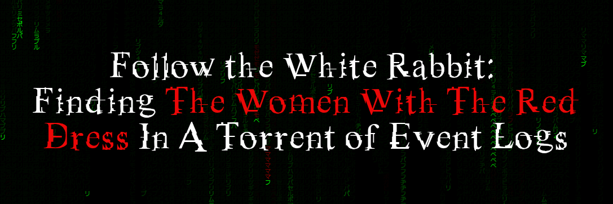
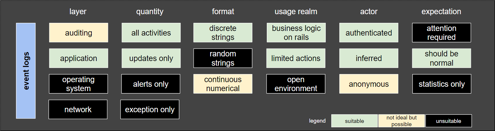
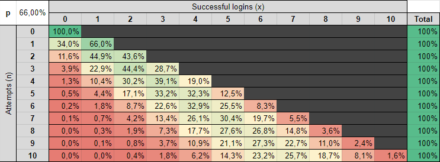
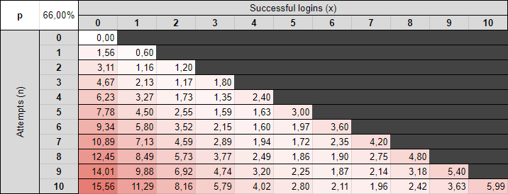
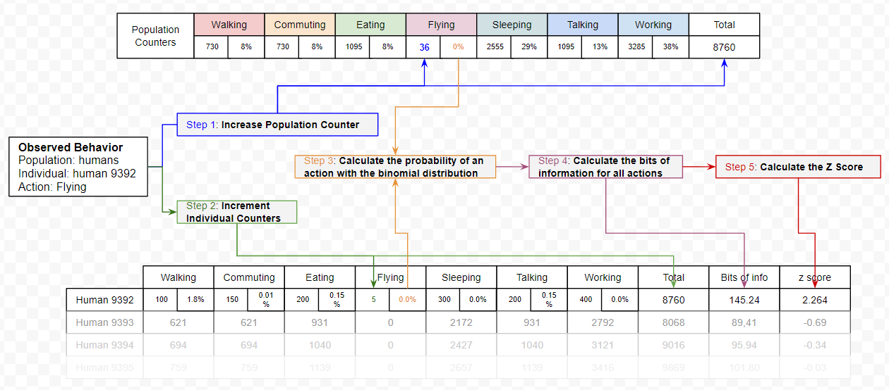

# looking-binormal

This is a follow up post on [Suspecting the Unsuspected. Extracting and Analyzing Log Anomalies](https://engineering.mercari.com/en/blog/entry/20220527-suspecting-the-unsuspected-extracting-and-analyzing-log-anomalies/). While the previous post demonstrated a nice way to assign an information value to any action based on its probability to be observed, it did had a few blind spots. This blog post will build over what was explained previously, and will present a way to assign an information value for the absence of actions. If you have time, it's a good read too and will help to understand what is being used here.

# TL;DR
Identifying outliers in a web application where all options are meant to be used can be challenging, but it is possible. 

The hypothesis is that individuals in a defined population should be using actions in a similar proportion. Using the probability mass function equation of the binomial distribution, we can evaluate the likelihood we are to observe someone using each action, and give a likelihood score for the sum of all their actions, or inactions. The less likely, the greater the chances that we are observing an outlier. Malicious or not needs to be determined, but being able to single these individuals out can help.

The use cases for this method are limited to environments where we can see a large quantity of predictable and discrete actions.

The source code is available [on Github](https://github.com/cerebraljam/looking-binormal). See the [TRYME.md](https://github.com/cerebraljam/looking-binormal/blob/main/TRYME.md) file for instruction on how to execute it.

# 1. Introduction: "Do you always look at [the Matrix] encoded?" -- Neo, The Matrix, 1999

Looking at streams of logs is overwhelming. Maybe if we stared for a while we would start to see normal patterns and identify outliers.

In my last blog post, I demonstrated a method to translate probabilities of observing a given event into an information value in bits. By calculating the sum of the bits of information generated by each user, we can make the ones with the less likely behaviors stand out.

However, that method has a significant weakness: we can only identify outliers when they are doing something.

How about agents who are not doing something we would expect a normal user to do? Bots and malicious agents often fall into this category. Because these agents likely have a specific objective and are likely to limit their actions to the minimum necessary to reach their goal, they might skip some normal actions, or use them in different proportions. This detail is significant. The previous method couldn't take it into account.

When a population is expected to have a normal behavior, it is possible to identify the agents who are not. This blog post will demonstrate one way to do so.

Get ready to see how deep the rabbit hole goes. Sadly, no red pill will make this clearer, but some math will.

## 1.1. What does it mean to be normal in the first place?

If we take a given population and compare their height, weight, age, number of eyes and fingers, we can expect that values will fall within certain ranges. Anything outside of these ranges would be considered less likely the further they are from the average.

Looking at numerical values makes it easy to calculate the average and how far one can be away from it. If one's height 30cm, weight 5kg, is 102 years old, has 3 eyes and 16 fingers, that individual should fall outside of our expectations for a normal Earthling, but could be normal for the alien population in a movie.

Identifying what type of population we are dealing with is key to defining if an individual is expected to fit in it or not.
But what if we are dealing with action events? These typically consist of discrete actions. Walking, Eating, Flying, Sleeping, Talking, 
Working, etc. By themselves we can't just average these values, but we can calculate their frequency, or the probability of being observed in a given population.

To achieve this, I will use a few mathematical tools: Probability distribution, Binomial Distribution, Information Theory, Gaussian Distribution, Standard Deviation and the Z Score. All were covered in the previous article, with the exception of one: Binomial Distribution. This was the missing part that allows us to analyze the absence of events.

The next section will explain how it can be used. For the other concepts, please refer to the previous post.

## 1.2. How can we use the binomial distribution to calculate the likelihood of observing a specific behavior?

Here is the idea through an example.

**Hypothesis**: When authenticating to a system, an individual is expected to login successfully 66% of the time, doing a typo one in three times.

**Question**: Knowing this probability, what is the likelihood of observing "x" successful logins for "n" attempts?

**Answer**: Using the Probability Mass Function of the Binomial distribution, we can evaluate the probability of observing each outcome. Here is what it will look like up to 10 attempts.

Explanations of the table:

* 0 success in 0 attempt: 100% of the time, when someone isn't trying to login, we will not see a successful login. If a successful login is observed without an attempt, we have a problem.
* 0 or 1 success in 1 attempt: Someone missing an attempt is still normal 34% of the time, being successful on the first try is normal 66% of the time.
* 0 success in 4 attempts: This should happen 1.34% of the time.
* 10 success in 10 attempts: This case is also unlikely with a probability of 1.57%. We should expect some typos. I know, people use password managers, but if we are looking at IP addresses logging in with different usernames without failures, this streak of success can mean something else.

Knowing the likelihood of observing each possible outcome, we can assign an information value in bits by calculating the -log2 of the resulting probability of the binomial distribution.

Here is the same table, but with each value converted in bits

And then we can repeat for each possible action offered by the system.

* What is the percentage of time an individual will use the search function?
* What is the probability that an individual will change their physical address?
* What is the probability that an individual will change their phone number?
* What is the probability that someone will comment on an item?
etc.

We can then sum up the bits of information produced by each individual and calculate how far their behavior is against the average population using the Z Score equation.

where:
* x is the value of a given individual,
* μ is the mean of the population,
* σ is the standard deviation of the population.

# 2. Putting Everything Together, Backward

Explaining the process from the end makes it easier to understand why each step is necessary.

* Step 5. We can separate abnormal people from the normal ones by calculating the Z score, giving how many standard deviations they are away from the average. For this, we need to know the average (μ) and the standard deviation (σ) of the population.
* Step 4. To calculate the average and standard deviation, we need to calculate the number of bits of information for each action distribution for each individual in the population.
* Step 3. To calculate the sum of bits of information generated by each individual, we need to apply the binomial distribution function for each possible action that can be taken by the population.
* Step 2. This implies that we have kept a count of the number of times each individual performed each action.
* Step 1. To compare against the general population, we need to keep a count of how many times each action has been observed overall, and calculate its probability against the total amount of actions observed.

## About Identifying the Population

This is probably the most important part: We can only compare actions from a population that is expected to behave in the same ways.

Good examples could be:

* Authenticated users of a web application will mostly use the same functions with a similar proportion: Individuals might have different profiles (buyers, sellers), but overall the actions should look alike.
* The members of the customer support center who are going to be responding to similar requests: They are likely going to use a defined application and answer similar requests using a defined set of steps.

A population with relatively unpredictable behaviors will not produce good results:

* All the Google Drive activities: employees are more likely to generate bursts of inconsistent activities. Looking at documents, search, add or download files patterns is unlikely to be the same for every employee or event for a given employee over time.
* System activity logs for all employee's laptops.
* Sysadmins debugging servers: Debugging is exceptional by nature

# 3. Demonstration

For the demonstration, I will be using event logs from one of our systems. The details of this system aren't important for the demonstration to work. However, it does meet the population isolation requirements mentioned in the previous section:

* The population is expected to have a similar behavior. More than 99.9% should be legitimate users. Anyone who is 3σ (Z score of 3 or more) over the mean is considered an outlier.
* The individuals can use around 60 distinct actions. Each of them is meant to be used and are considered legitimate if used normally.
* The population will use the application for a range of time, depending on the individuals.

To visualize the results of the algorithm on the logs of the system, I substituted each action by a distinct character through a hashing function.

* Login -> ア
* Chat -> イ
* Browse -> ウ
* etc.

The output look like this:

* Each individual is assigned to a given column. Multiple individuals may share the same column if there are more individuals than columns.
* Their first action will always start from the top and go down with each new action.
* Having evaluated the Z Score of each, we can filter out likely inoffensive individuals under a certain threshold.
* Individuals with a behavior profile under 3σ are colored in green, any outliers (over 3σ) are in red.

While this visualization is obviously meant to be pretty, the underlying code can actually be used as part of a monitoring system to highlight potential deviating agents and take action if needed.

## Source code
The source code generating this output is available [on Github](https://github.com/cerebraljam/looking-binormal). See the [TRYME.md](https://github.com/cerebraljam/looking-binormal/blob/main/TRYME.md) file for instruction on how to execute it. Pull requests are welcome.

# 4. Conclusion

Standing out as an outlier doesn't mean that the behavior is malicious. It simply means that it isn't matching the expected distribution of actions for a given population.

However, being able to identify these outliers can help to spot potentially malicious agents in a really large population of individuals can be quite useful.

## What could be done next...

The current code isn't labeling behavior patterns, but it would be relatively easy to do by identifying actions (not) performed with a small expected probability, use these actions to create a label, and then cluster individuals based on these actions.

... but I will leave this for another time.

# 6. More Reading

* [Definition of the Probability Mass Function on Wikipedia](https://en.wikipedia.org/wiki/Binomial_distribution#Probability_mass_function). 
* [3Blue1Brown on Youtube: Binomial distributions | Probabilities of probabilities, part 1](https://www.youtube.com/watch?v=8idr1WZ1A7Q)
* Python3 [Scipy.stats.binom library](https://docs.scipy.org/doc/scipy/reference/generated/scipy.stats.binom.html)
* Go https://pkg.go.dev/gonum.org/v1/gonum/stat/distuv#Binomial
* MIT News [Explained: Sigma - How do you know when a new finding is significant? The sigma value can tell you - but watch out for dead fish](https://news.mit.edu/2012/explained-sigma-0209)
